<p align="center">
  
</p>

<h1 align="center">Full Quaternion-Based Attitude Control for a Quadrotor</h1>

<p align="center">
  <b>A Python Software-In-The-Loop Reproduction, Stability Analysis, and 6-DOF Extension</b><br>
  Group 12 · School of Artificial Intelligence, Amrita Vishwa Vidyapeetham
</p>

<p align="center">
  
  
  
  
</p>

---

<p align="center">
  <a href="https://quadrotor-quaternion-sim.vercel.app"><b>🌐 Live: four-simulator results & benchmark</b></a>
  &nbsp;·&nbsp;
  <a href="https://quadrotor-quaternion-sim.vercel.app/simulator.html"><b>🎮 Interactive simulator — fly the paper's controller in your browser</b></a>
</p>

## Overview

Euler angles hit gimbal lock and pay a repeated trigonometric cost; the DCM carries nine
constrained states. Fresk and Nikolakopoulos's point is that a quadrotor's attitude plant
*and* controller can live **entirely in quaternion space** — no Euler or DCM computation
anywhere in the loop. This project reproduces that work exactly: every equation (1)–(21)
is implemented function-for-function, under the paper's own gains, inertia, torque bounds,
and measurement noise, and verified by a 27-test suite.

Two original contributions go beyond reproduction:

1. **A discrete-time stability analysis the paper does not perform** — showing the paper's
   own gains and inertia make a plausible digital control rate (200 Hz–1 kHz) *provably
   unstable*, and deriving the minimum safe rate (≈ 12.3 kHz) exactly, not by trial.
2. **A 6-DOF PX4-style extension** (`pysitl/`) — the *unmodified* controller flying a real
   rigid-body vehicle (rotors, mixer, gravity, ground contact, message bus, scheduler,
   failsafes, browser ground station), with mass and geometry *derived* from the paper's
   published inertia rather than assumed.

### Base paper

> E. Fresk and G. Nikolakopoulos, *"Full Quaternion Based Attitude Control for a Quadrotor,"*
> **2013 European Control Conference (ECC)**, Zürich, pp. 3864–3869.
> [DOI: 10.23919/ECC.2013.6669617](https://doi.org/10.23919/ECC.2013.6669617) ·
> [Open-access PDF](https://www.diva-portal.org/smash/get/diva2:1010947/FULLTEXT01.pdf)

## Team

| Name | Roll No. | Email |
|---|---|---|
| Manohar Paturi | CB.SC.U4AIE24339 | cb.sc.u4aie24339@cb.students.amrita.edu |
| K Pushpak | CB.SC.U4AIE24328 | cb.sc.u4aie24328@cb.students.amrita.edu |
| Sai Krishna | CB.SC.U4AIE24308 | cb.sc.u4aie24308@cb.students.amrita.edu |
| B Sainath | CB.SC.U4AIE24309 | cb.sc.u4aie24309@cb.students.amrita.edu |
| Vishal | CB.SC.U4AIE24363 | cb.sc.u4aie24363@cb.students.amrita.edu |

## How it works

The closed loop never leaves quaternion space — Euler angles appear only in plotting and
logging (eq. 16):

```text
        q_ref
          │
          ▼
   q_err = q_ref ⊗ q_m*            -- eq. (19)
          │  take vector part
          ▼
   Axis_err                         -- eq. (20)
          ▼
   τ = −P_q·Axis_err − P_ω·ω_m      -- eq. (21), saturated at ±4 N·m
          ▼
   Quadrotor attitude plant         -- eqs. (17)–(18)
          │
          ▼
   q_m , ω_m  (uniform ±0.1 noise) ──► fed back to q_err
```

The law is derivative-free and needs no integral term: torque → $\dot\omega$ → attitude is
a double integrator, so steady-state error decays to zero on its own. Where the paper's
sign on eq. (18) differs from the textbook convention, it is **preserved literally**, not
silently corrected (see Fidelity notes).

## Repository contents

| Path | Contents |
|---|---|
| [`quat_sitl/`](quat_sitl/) | **Paper reproduction** — quaternion algebra (eqs. 1–16), plant (eqs. 17–18), P² controller (eqs. 19–21), noise model, three benchmark scenarios, plots, 3D replay viewer |
| [`pysitl/`](pysitl/) | **6-DOF PX4-style extension** — rotors, mixer, gravity, ground contact, uORB-style bus, multi-rate scheduler, arming/failsafes, altitude hold, autopilot, CSV logging, browser ground station |
| [`scenarios/`](scenarios/) | Runnable benchmark scripts (step / sine / flip) |
| [`tests/`](tests/) | 27 tests: 7 paper-reproduction, 20 six-DOF |
| [`docs/figures/`](docs/figures/) | Result figures used below |
| [`REPORT.md`](REPORT.md) · [`report1.md`](report1.md) · [`file_structure.md`](file_structure.md) | Full technical report · project report #1 · file-by-file map with equation citations |
| [`pysitl/README.md`](pysitl/README.md) · [`pysitl/UI_GUIDE.md`](pysitl/UI_GUIDE.md) | 6-DOF design notes · ground-station manual |
| [`fresk_nikolakopoulos_precise_attitude_simulator_xyz_labels(1).html`](fresk_nikolakopoulos_precise_attitude_simulator_xyz_labels%281%29.html) | Standalone zero-dependency browser simulator (single HTML file) |

## Quickstart

```bash
pip install -e .
pytest tests/ -v                                             # 27/27 pass

# Paper reproduction — writes timestamped CSV + PNGs to results/
python -m quat_sitl.simulator --scenario step --duration 15 --seed 0 --noise 0.1
python scenarios/step_response.py
python scenarios/sine_tracking.py
python scenarios/flip_360.py
python -m quat_sitl.visualize3d                              # animated 3D replay

# 6-DOF extension
python -m pysitl.run --gcs                                   # browser ground station → http://127.0.0.1:8765
python -m pysitl.run --mode auto_step --duration 15 --log    # headless paper scenarios
python -m pysitl.run --mode auto_flip --duration 5 --log
```

In the ground station: **Arm**, pick a mode, fly with `W/S` (pitch), `A/D` (roll),
`Q/E` (yaw rate), `↑/↓` (throttle). Convenience launcher: `bash run_gcs.sh [port]`.

## Results vs. paper

Every numeric parameter the paper states is reproduced exactly:

| Quantity | Paper | Implemented | Match |
|---|---|---|---|
| $I_{xx}=I_{yy}$, $I_{zz}$ (kg·m²) | $6.5\times10^{-4}$, $1.2\times10^{-3}$ | same | Exact |
| $P_q$ / $P_\omega$ | 20 / 4 | 20 / 4 | Exact |
| Torque saturation | ±4 N·m | ±4 N·m | Exact |
| Sine amplitude / frequency | 0.5 rad, 1 rad/s | same | Exact |
| Flip range | 0 → 2π rad | same | Exact |
| Noise amplitude | 0.1 | 0.1 | Exact |

**Step** — 1 rad steps on $\phi,\theta,\psi$, staggered at $t=1,5,9$ s over 15 s.
Essentially no overshoot, ≈ 2 s settling per axis (paper Fig. 3–4).

<p align="center">
  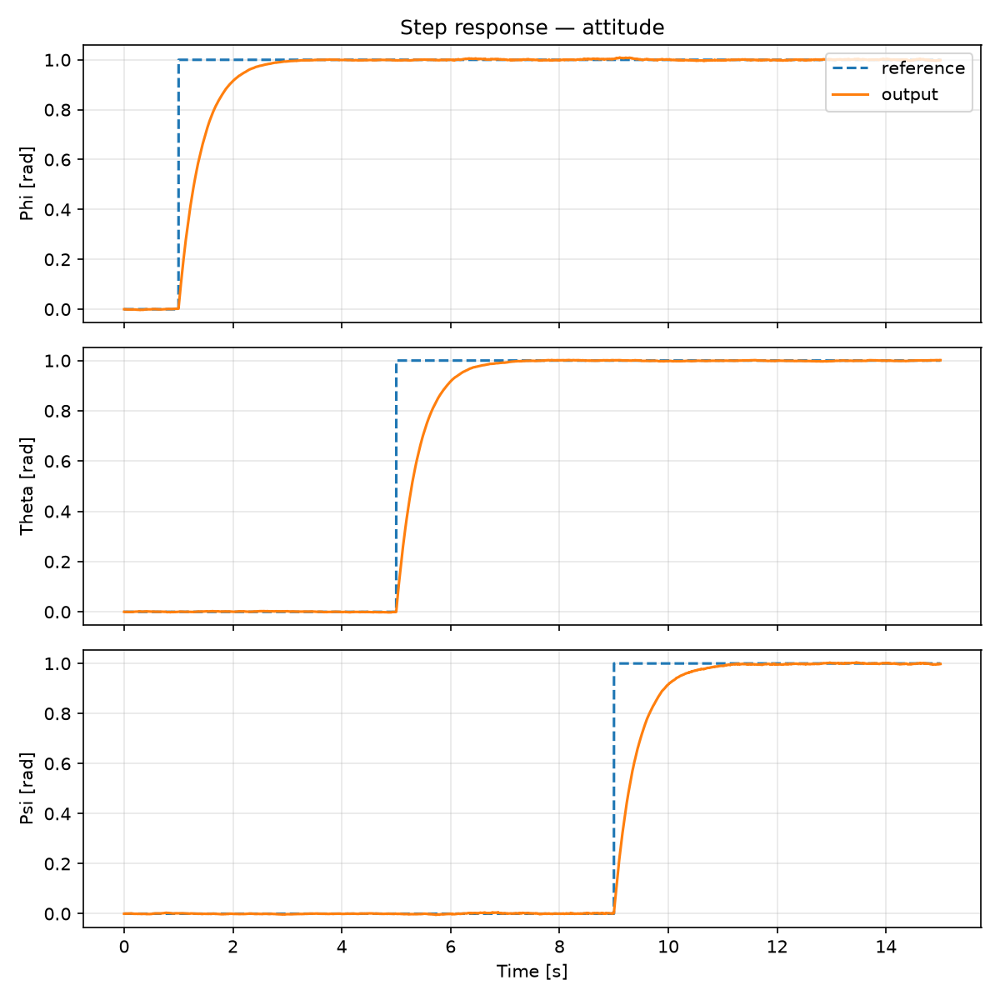
</p>
<p align="center">
  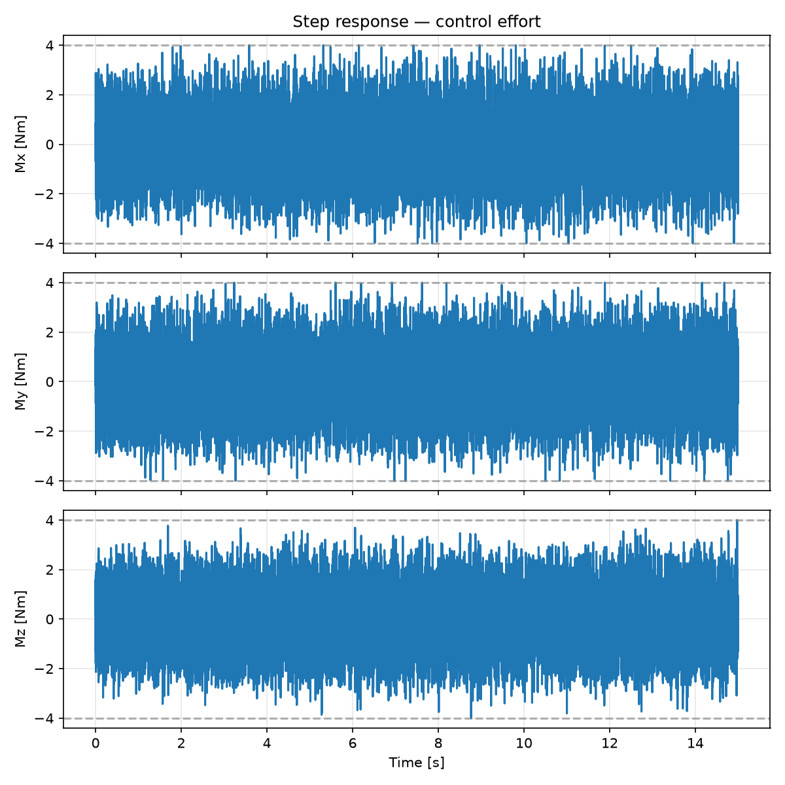
</p>

**Sine** — 0.5 rad, 1 rad/s on all axes, phase-shifted so torques stay out of phase.
Measured lag ≈ 0.4–0.5 s vs. the paper's "about 0.5 second"; torque stays linear
throughout steady state (paper Fig. 5–6). *(One logged sample at $t=0.001$ s saturates —
a startup transient, since the phase-shifted reference starts at 0.5 rad, not a tracking
defect.)*

<p align="center">
  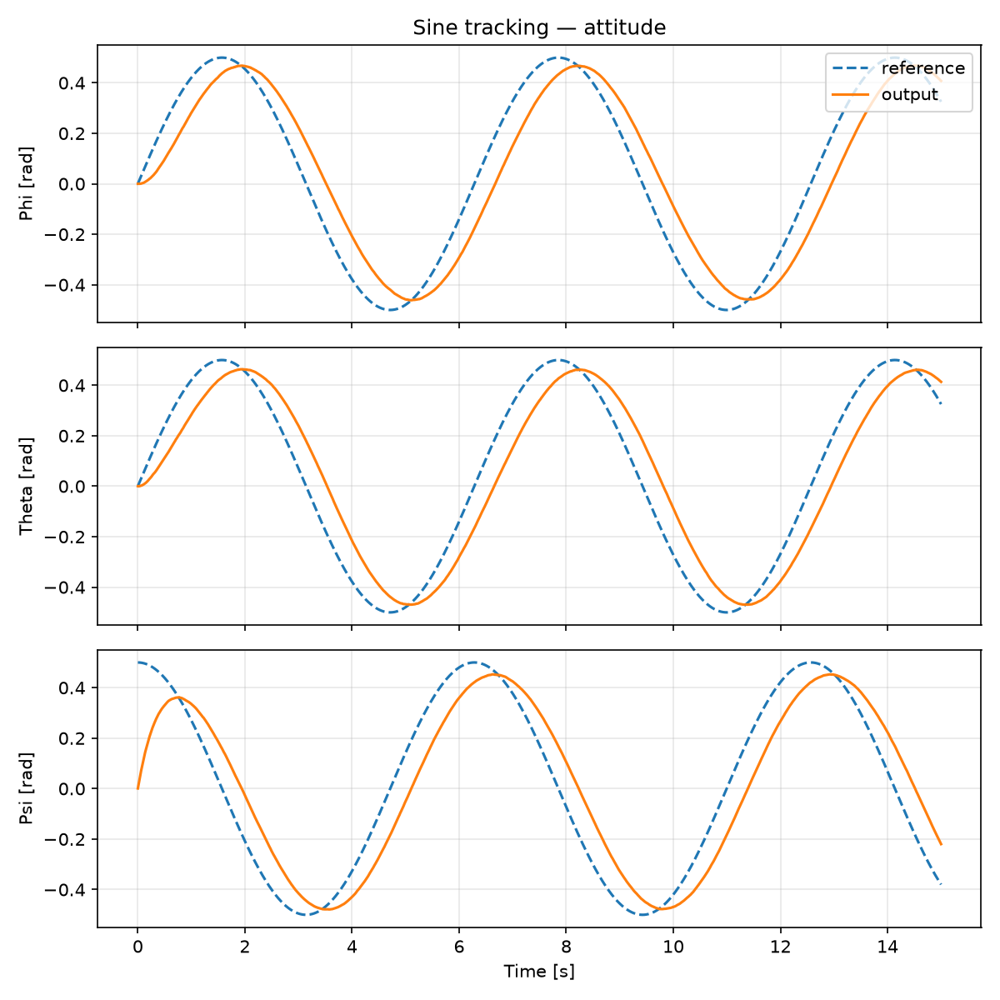
</p>
<p align="center">
  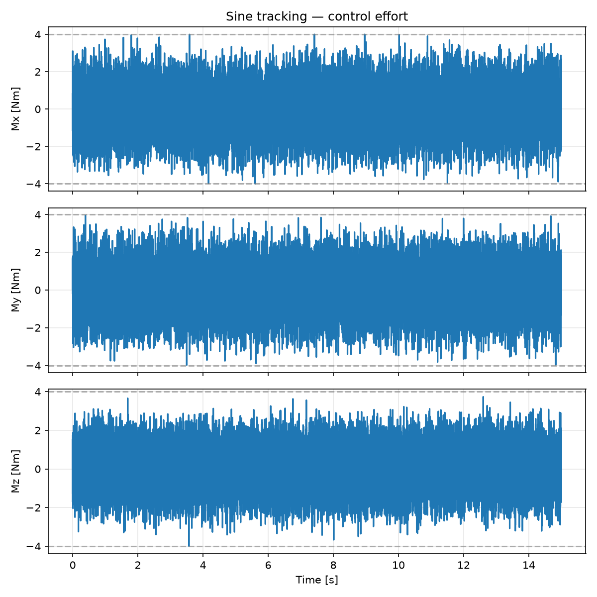
</p>

**360° flip** — shortest-path correction deliberately disabled; reference ramps 0 → 2π rad
over 2 s. Raw $q_0, q_1$ stay smooth through the full rotation — **no gimbal-lock
artifact**, the paper's central claim. The plotted Euler $\phi$ wraps at ±π only because
`atan2`'s range does (paper Fig. 7–8).

<p align="center">
  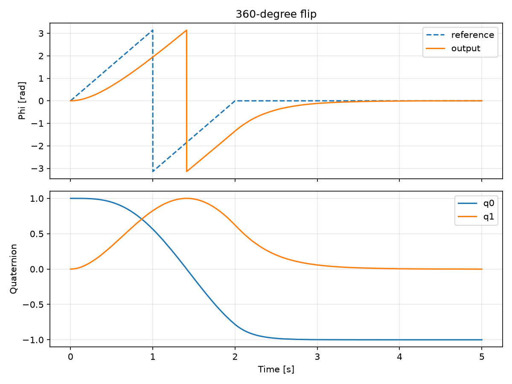
</p>
<p align="center">
  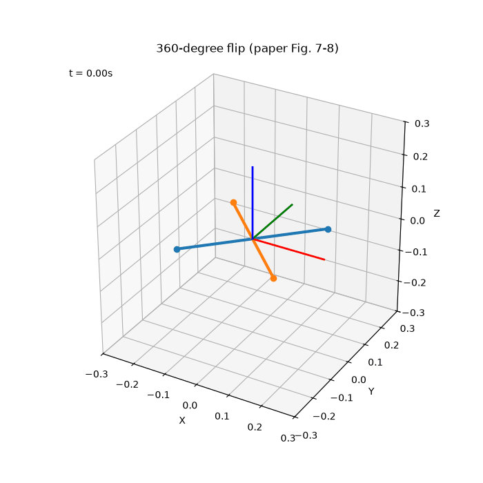
</p>

## Key finding: the control-rate stability bound

The paper specifies no digital control rate. A plausible 200 Hz control / 1 kHz plant
design **never converges** — for any step size. Linearizing the closed loop about identity
attitude:

$$I\,\ddot e + P_\omega\,\dot e + \tfrac{P_q}{2}\,e = 0
\;\Rightarrow\;
\lambda_{1,2} = \frac{-P_\omega \pm \sqrt{P_\omega^2 - 2IP_q}}{2I}
\approx -2.5,\ -6150\ \mathrm{rad/s}$$

The continuous loop is heavily overdamped ($\zeta\approx25$) and fine — the instability is
purely a **sampling artifact of the fast pole**. Exact zero-order-hold spectral radius
$\rho(A_{cl})$:

| Control rate | 200 Hz | 1 kHz | 10 kHz | 100 kHz |
|---|---|---|---|---|
| $\rho(A_{cl})$ | 29.9 | 5.16 | 0.9997 | 0.99997 |
| Stable? | No | No | Marginal | Yes |

Minimum safe rate, derived (not tuned): $f_{control} \ge P_\omega/(m \cdot I_{\min}) \approx$
**12.3 kHz** at margin $m=0.5$. `dynamics.stable_control_rate_hz` computes it from the
configured gains/inertia; the simulator adopts it by default (logging still at exactly
1 kHz, gains untouched); the 6-DOF scheduler refuses to run below it. Pass
`control_rate_hz=200.0` to `run_simulation` to reproduce the instability directly.
Full derivation: [`REPORT.md` §2.5](REPORT.md).

## Equation → function map

| Paper eq. | Description | Location |
|---|---|---|
| (1)–(2) | Quaternion product, `Q`/`Q̄` matrices | `quaternion.mul`, `quaternion.Q`, `quaternion.Q_bar` |
| (3)–(5) | Norm, conjugate, inverse | `quaternion.norm`, `.conj`, `.inv` |
| (6)–(7) | q̇, fixed-frame ω / body-frame ω′ | `quaternion.qdot_fixed`, `.qdot_body` |
| (8) | Rotation q ⊗ v ⊗ q* | `quaternion.rotate` |
| (9)–(13) | DCM columns and transpose | `quaternion.to_dcm` (+ `.T`) |
| (14)–(16) | Axis-angle / Euler ↔ quaternion | `quaternion.from_axis_angle`, `.from_euler`, `.to_euler` |
| (17)–(18) | Rigid-body plant | `dynamics.state_derivative`, `dynamics.InertiaParams` |
| (19)–(21) | Nonlinear P² controller | `controller.NonlinearP2Controller.compute_torque` |

## Fidelity notes

- **Eq. (18)'s minus sign is preserved deliberately** — $\dot q = -\tfrac12[0,\omega]^T\otimes q$,
  opposite to eq. (7). Verified against the published PDF, kept literal in `dynamics.py`,
  and guarded by a test that fails if either eq. (18)'s or eq. (21)'s sign were wrong
  ([`REPORT.md` §4.4](REPORT.md)).
- **Every paper ambiguity is resolved with a documented default**, never a silent guess:
  uniform noise $\mathcal{U}(-0.1,0.1)$; step stagger x@1 s / y@5 s / z@9 s; sine phases
  $\phi_y{=}0$, $\phi_z{=}\pi/2$; flip ramp 2 s; DCM in eq. (12) column form, pinned by
  test ([`REPORT.md` §3.3](REPORT.md)).
- **Control-signal → torque is the identity**, the paper's own stated simplification.

## The 6-DOF extension (`pysitl`)

The paper never needs mass or geometry, so both are *derived* from its inertia:
$I_{zz}/I_{xx}=1.846 \approx 2$ (planar-X point-mass quad) ⇒ $L=0.15$ m, ≈ 12.2 g rotors,
≈ 200 g total, ≈ 1.95 N hover thrust. The **unmodified** controller then flies this vehicle
through a PX4-shaped stack — uORB-style pub/sub bus, deterministic lockstep scheduler
(16 kHz physics/attitude/mixer, 1 kHz sensors, 250 Hz altitude, 50 Hz commander, 200 Hz
logger), arming + failsafes, thrust-preserving mixer desaturation, and a browser ground
station. Under full paper noise, a 0.3 rad roll command converges to 0.309 rad with
altitude held to centimeters.

Design decisions and derivations: [`pysitl/README.md`](pysitl/README.md) ·
dashboard manual: [`pysitl/UI_GUIDE.md`](pysitl/UI_GUIDE.md).

## Testing

| Suite | Tests | Covers |
|---|---|---|
| `test_quaternion.py` | 7 | Non-commutativity, identity, DCM orthonormality/round-trip, rotation consistency, norm drift, fixed point, closed-loop sign consistency |
| `test_sitl.py` | 20 | Frame conventions, eq. 18 parity, hover, ground contact, mixer + desaturation, noise bounds, tracking under noise, scheduler determinism/rate rejection, arming/failsafes, bus semantics, flip completion |

Several are regressions for bugs found and fixed during development. `pytest tests/ -v`
runs both suites.

## Future work

The `MotorModel` interface and the controller's independence from plant internals are
deliberately swappable — the natural next step is a MAVLink bridge (`pymavlink`/`mavsdk`)
so the same unmodified `NonlinearP2Controller` can drive an ArduPilot/PX4 SITL instance.

## References

[1] E. Fresk, G. Nikolakopoulos, "Full Quaternion Based Attitude Control for a Quadrotor,"
*ECC 2013*, pp. 3864–3869. [doi](https://doi.org/10.23919/ECC.2013.6669617)

[2] J. B. Kuipers, *Quaternions and Rotation Sequences*, Princeton Univ. Press, 1998. ·
[3] J. Diebel, "Representing Attitude," Stanford, 2006. ·
[4] S. Bouabdallah, R. Siegwart, "Full Control of a Quadrotor," *IROS 2007*. ·
[5] A. Tayebi, S. McGilvray, "Attitude Stabilization of a VTOL Quadrotor Aircraft,"
*IEEE TCST*, 2006. ·
[6] PX4 Development Team, [docs.px4.io](https://docs.px4.io/) — architecture reference for
the scheduler/bus/commander patterns. ·
[7] This repository — equation-to-function citations in [`file_structure.md`](file_structure.md);
full methodology and discussion in [`REPORT.md`](REPORT.md).

---

# Cross-simulator results — the paper's controller on four simulators

> **The deliverable for the final evaluation:** Fresk & Nikolakopoulos's
> quaternion attitude law, gains **untouched** (P&#8347;=20, P&#969;=4, ±4 N·m),
> flying the same derived paper vehicle (0.2 kg, Ixx=Iyy=6.5e-4, Izz=1.2e-3 kg·m²)
> on **gym-pybullet-drones**, **MuJoCo**, **Gazebo**, and **ArduPilot SITL**
> through one shared bridge. All code, tests, and runbooks live on the
> [`sainath/sim-deployment`](https://github.com/Sainath-Reddy7/Drones_S5_CD_12_Full_Quaternion_Based_Attitude_Control_for_a_Quadrotor/tree/sainath/sim-deployment)
> branch; live pages: [results &amp; benchmark](https://quadrotor-quaternion-sim.vercel.app) ·
> [interactive simulator](https://quadrotor-quaternion-sim.vercel.app/simulator.html).

| Stack | Status | One-line result |
|---|---|---|
| **MuJoCo** (20 kHz, contact physics) | ✅ validated natively | all 3 paper scenarios; flip completes **fully airborne**, 3 seeds, φ settles 2.87–2.97 s |
| **gym-pybullet-drones** (24 kHz, custom paper-vehicle URDF) | ✅ validated natively | step & sine within **0.2° RMS of MuJoCo** — the loop belongs to the controller, not the engine |
| **Gazebo** (gz-sim SDF 1.10 world + ardupilot_gazebo) | 🟦 runbook-ready, runs under WSL2 | one-shot `bash sim/gazebo/run_gazebo.sh step` |
| **ArduPilot SITL** (MAVLink `SET_ATTITUDE_TARGET` @ 50 Hz) | 🟦 bridge-ready, runs under WSL2 | the controller as an outer loop, exactly as on hardware |

## Headline

With identical gains, references, and the paper's ±0.1 noise model, **step and
sine tracking agree across two independent physics engines to within 0.2° RMS**
(MuJoCo 17.71°/17.61° vs PyBullet 17.68°/17.52°). The 360° flip completes
deterministically on MuJoCo and hits an engine-dependent limit cycle on
PyBullet — analyzed as the P² pursuit equilibrium ω = 5·sin(e/2) (Eq. 33 in
`file_structure.md` on the branch).

## Full benchmark (machine-generated by `python -m sim.compare`)

| simulator | scenario | RMS att. err [deg] | max att. err [deg] | settle phi [s] | settle theta [s] | settle psi [s] | torque sat. [-] | drift [m] | duration [s] |
|---|---|---|---|---|---|---|---|---|---|
| gym_pybullet | flip | 115.19 | 179.88 | 5.00 | 5.00 | 5.00 | 0.79 | 28.19 | 5.00 |
| gym_pybullet | flip | 113.82 | 179.88 | 5.00 | 4.47 | 5.00 | 0.79 | 29.11 | 5.00 |
| gym_pybullet | flip | 115.72 | 179.91 | 5.00 | 4.70 | 5.00 | 0.79 | 29.05 | 5.00 |
| gym_pybullet | sine | 17.52 | 41.17 | 12.47 | 8.65 | 5.85 | 0.01 | 105.39 | 15.00 |
| gym_pybullet | step | 17.68 | 70.74 | 13.97 | 0.87 | 6.00 | 0.02 | 1275.92 | 15.00 |
| gym_pybullet | step | 17.58 | 71.84 | 14.00 | 0.83 | 6.00 | 0.02 | 1276.38 | 15.00 |
| mujoco | flip | 44.39 | 91.91 | 2.88 | 0.00 | 0.00 | 0.01 | 54.40 | 5.00 |
| mujoco | flip | 44.55 | 91.32 | 2.97 | 0.00 | 0.00 | 0.01 | 54.43 | 5.00 |
| mujoco | flip | 44.51 | 90.91 | 2.95 | 0.00 | 0.00 | 0.01 | 54.52 | 5.00 |
| mujoco | sine | 17.61 | 41.10 | 12.47 | 8.65 | 5.82 | 0.01 | 105.66 | 15.00 |
| mujoco | step | 17.71 | 71.18 | 13.97 | 0.86 | 6.00 | 0.02 | 1864.86 | 15.00 |
| mujoco | step | 17.66 | 72.92 | 14.00 | 0.83 | 6.00 | 0.02 | 1875.99 | 15.00 |

*seeds 0–2 for flips; settle times use the noise-aware band; drift is
expected — the paper controls attitude only. Lower is better except duration.*

## The paper's three scenarios — MuJoCo (frozen controller, full ±0.1 noise)

| Step: 1 rad staggered at t=1,5,9 s | Step torque (paper Fig. 4) |
|---|---|
| 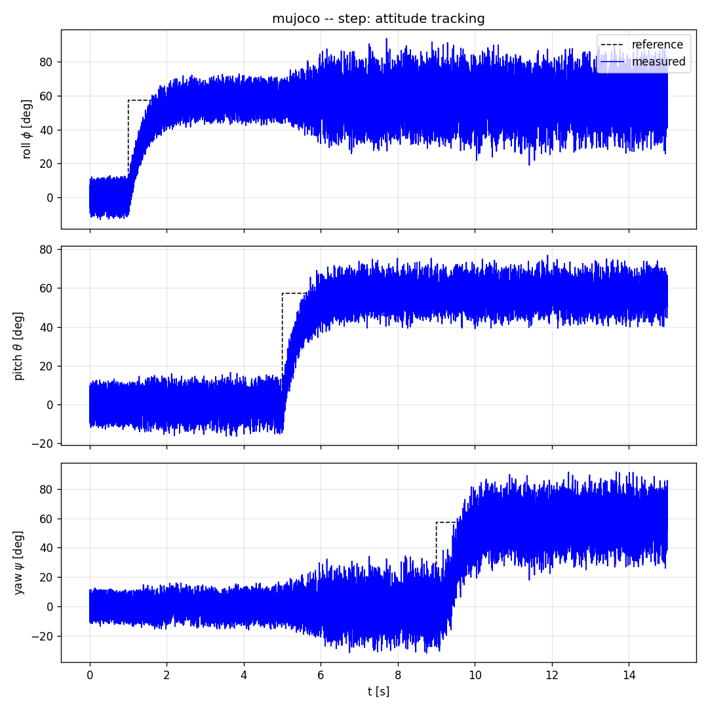 | 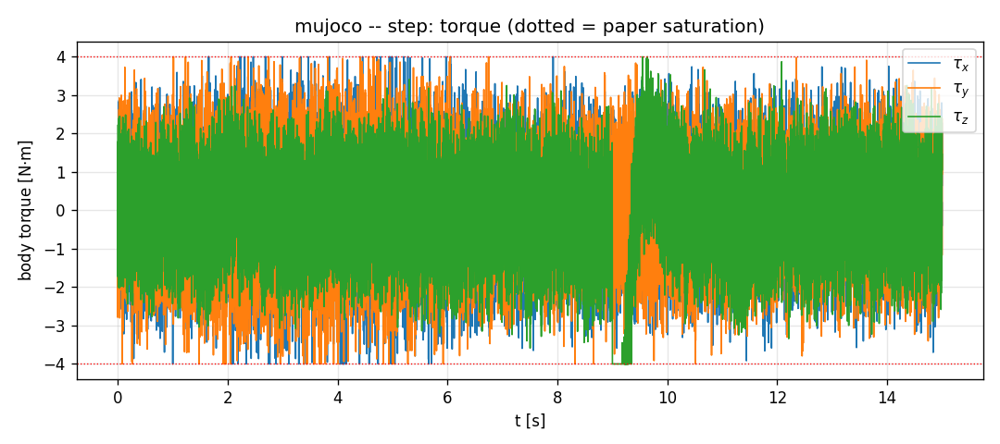 |

| Sine: 0.5 rad, 1 rad/s (paper Figs. 5–6) | 360° flip from 60 m — completes airborne, no gimbal lock |
|---|---|
| 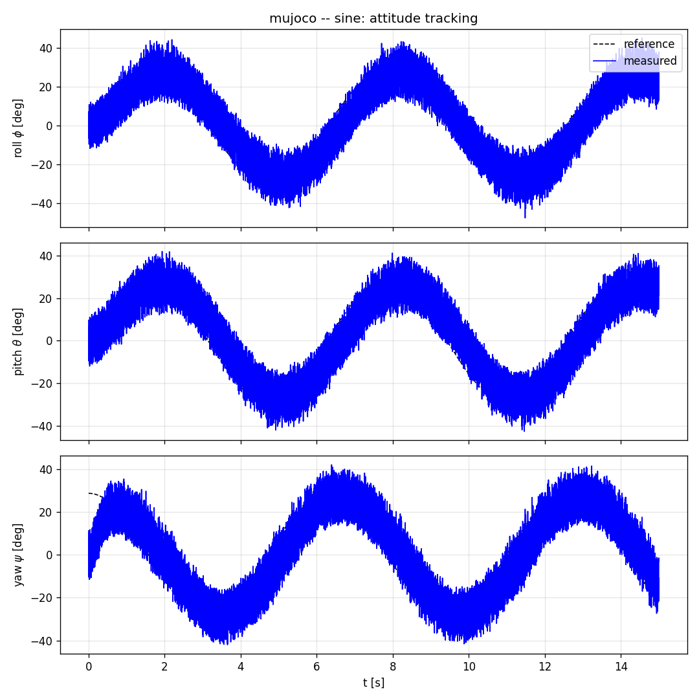 | 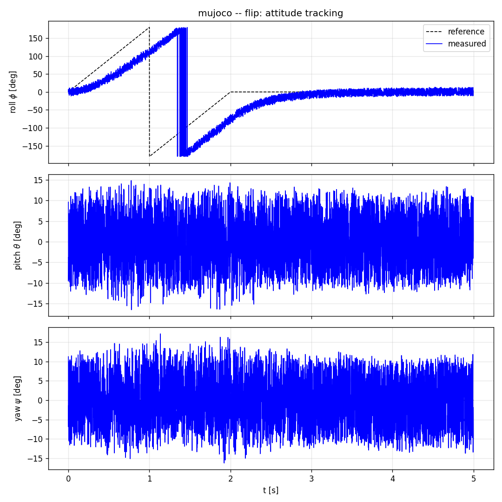 |

## Same controller, same references — gym-pybullet-drones

| Step tracking — statistically identical to MuJoCo | Step torque — cross-engine agreement |
|---|---|
| 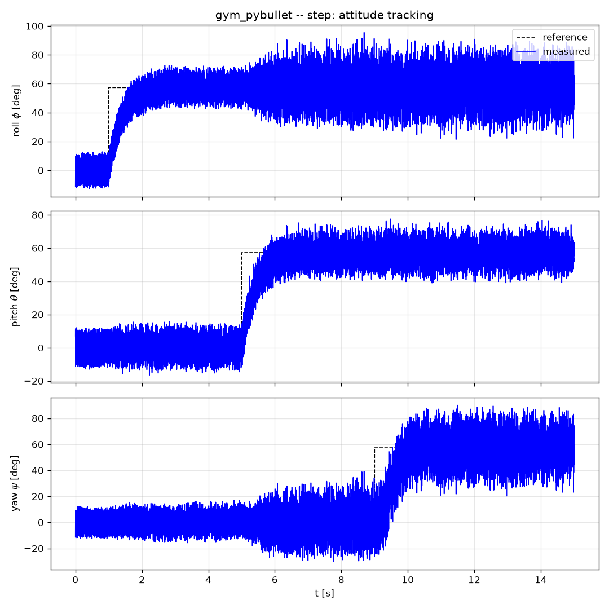 | 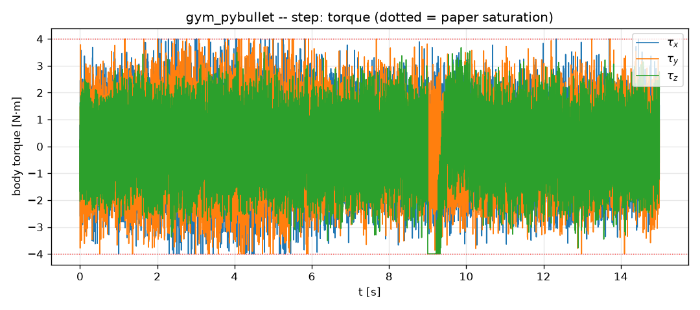 |

| Sine tracking | Flip: documented engine-dependent limit cycle (finding 4) |
|---|---|
| 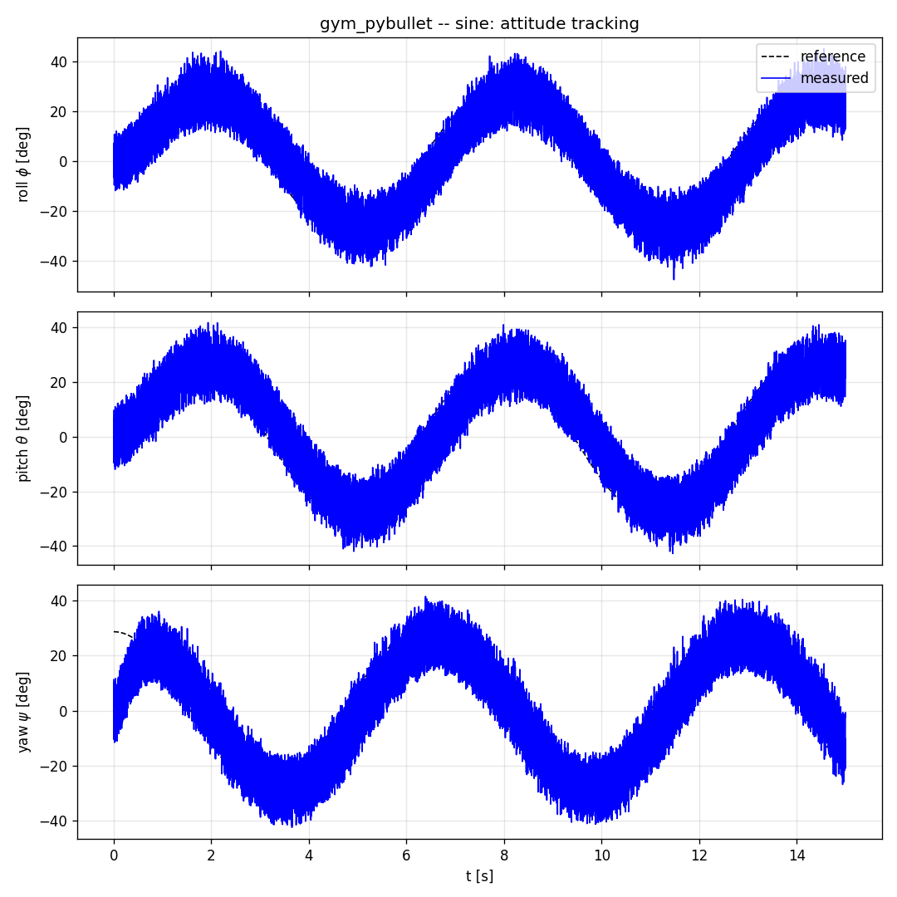 | 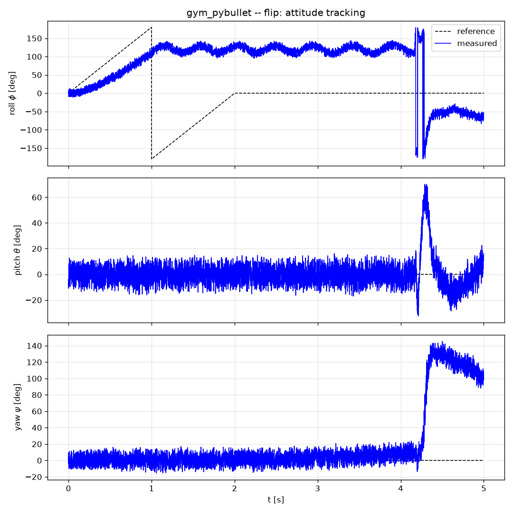 |

## Findings (full detail in `sim/README.md` on the branch)

1. **The controller transfers across engines** — 0.2° RMS cross-engine agreement on step/sine.
2. **The ±4 N·m bound is not rotor-realizable** (~0.4 N·m physical max); yaw's tiny authority under ±0.1 noise forced PX4-style *priority* mixer desaturation (Eq. 32).
3. **Flips need acro thrust handling** — idle when inverted, cap when torque demand is high; otherwise the flip deadlocks at exactly 180°.
4. **The flip is knife-edge on rotor plants** — rate equilibrium ω=5·sin(e/2); 2 s ramp trackable only at lag ≈1.36 rad (Eq. 33).
5. **The 12.3 kHz control-rate bound carries over** — adapters run the controller every physics step and assert the derived minimum at startup.
6. **Integration gotchas documented** — GRAVITY-is-weight, PyBullet damping, MJCF massless-sites, spawn-at-scenario-altitude.

## Simulation website

**[quadrotor-quaternion-sim.vercel.app/simulator.html](https://quadrotor-quaternion-sim.vercel.app/simulator.html)**
— the paper's equations (1)–(21) as a zero-dependency browser app:

- the three benchmark scenarios (**step / sine / flip**) plus a **manual** mode
- live **P&#8347;/P&#969; gain sliders** and the paper's **±0.1 noise** control — watch
  the closed loop respond as you change them
- 3D quadrotor scene, attitude/rate HUD, adjustable sim speed (0.5×–2×),
  reseedable noise, and **CSV export** of the run

The [main page](https://quadrotor-quaternion-sim.vercel.app) of the same site
carries the four-simulator benchmark: status cards, the full results table,
and the tracking figures — all machine-generated by `python -m sim.site_gen`.

## Reproduce everything

```bash
git clone https://github.com/Sainath-Reddy7/Drones_S5_CD_12_Full_Quaternion_Based_Attitude_Control_for_a_Quadrotor.git
cd Drones_* && git checkout sainath/sim-deployment
pytest tests/ -q                                     # 39 tests
bash sim/run_all.sh                                  # whole native benchmark
python -m sim.compare                                # the table above
python -m sim.site_gen                               # the live site pages
```
