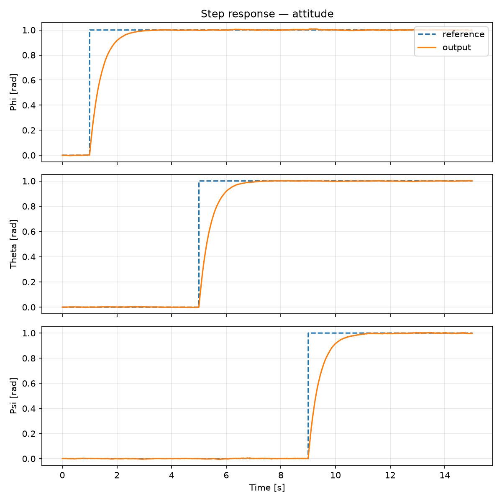
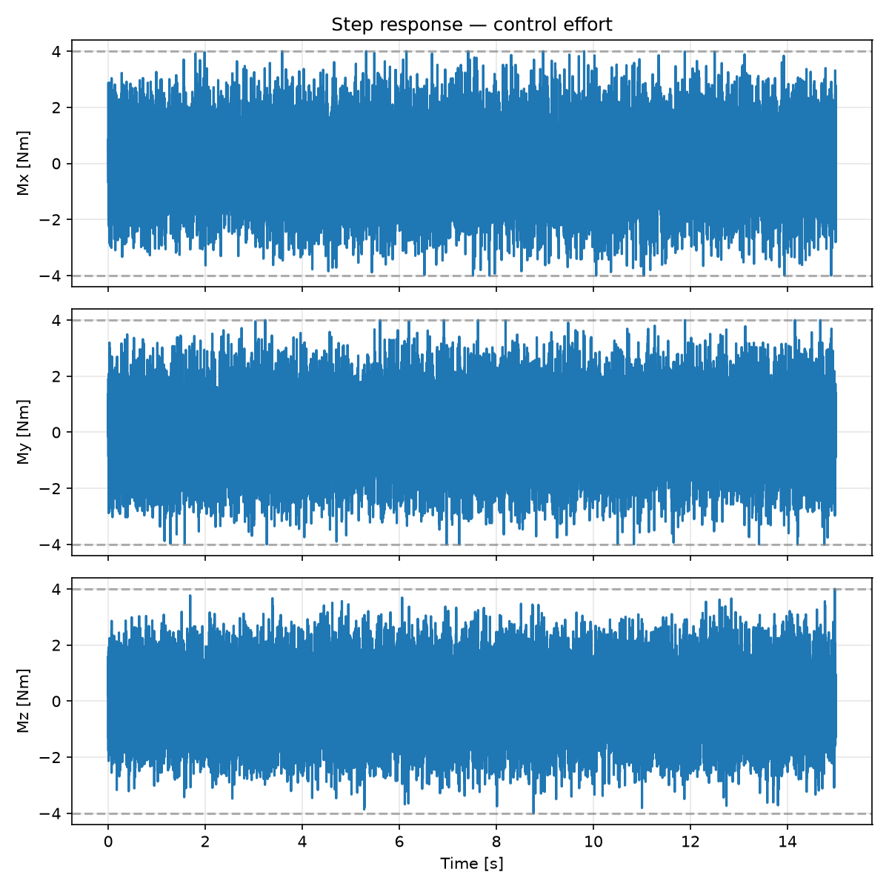
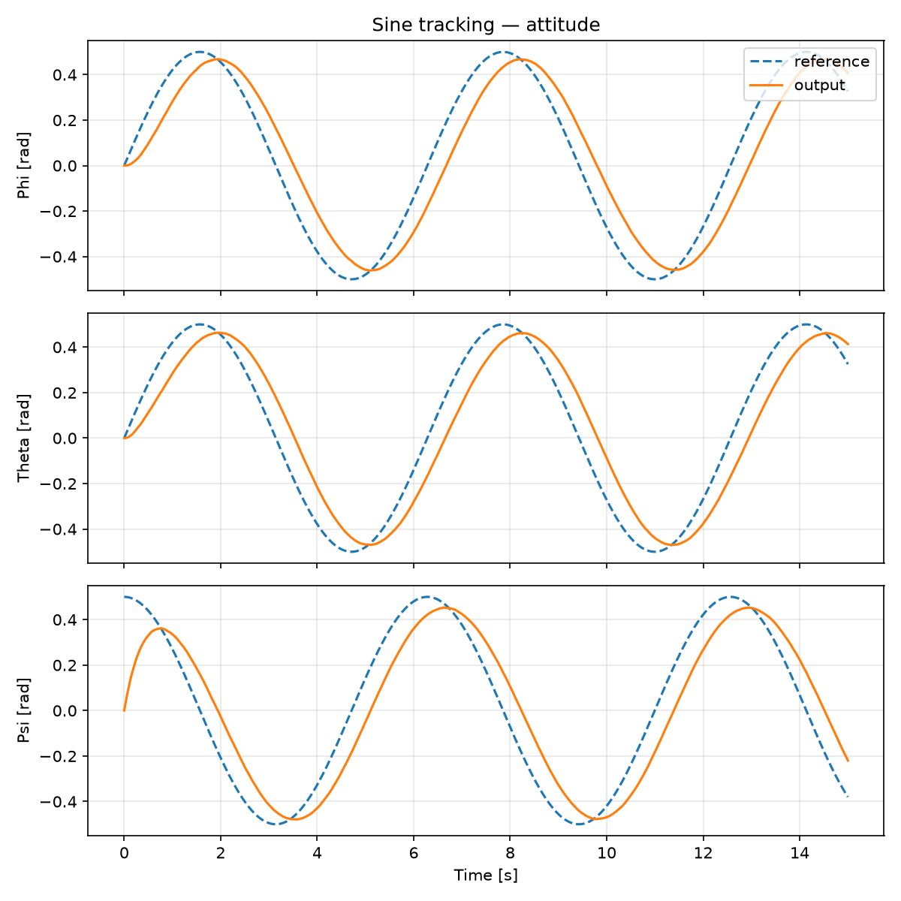
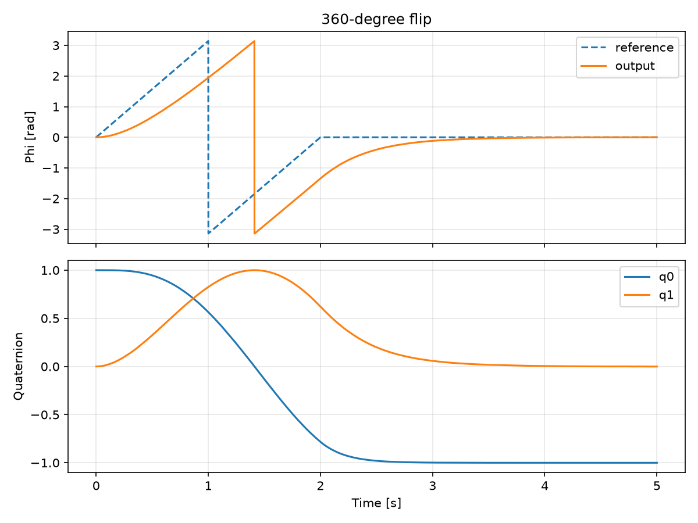
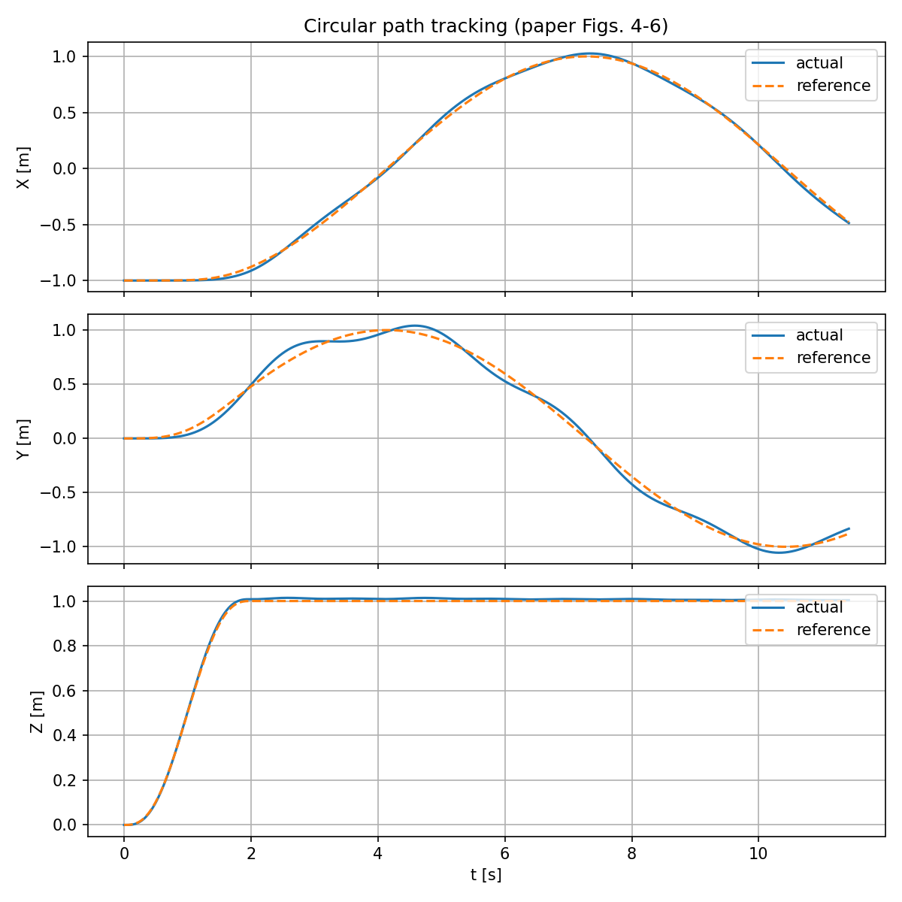
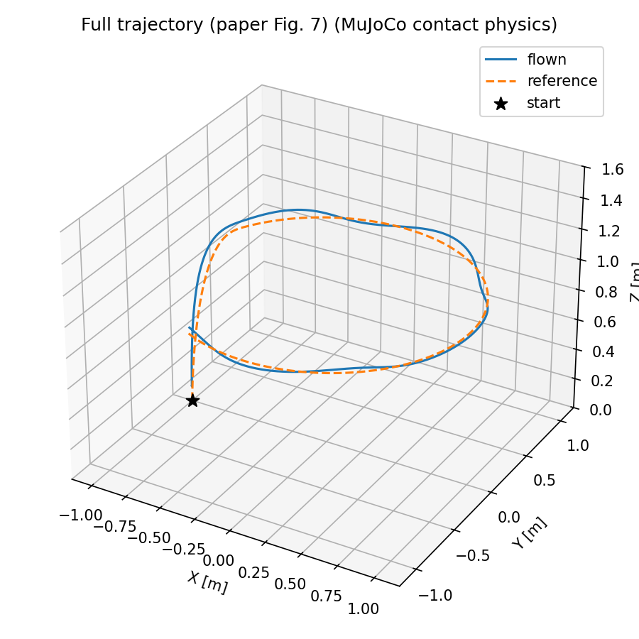

<p align="center">
  
</p>

<h1 align="center">Full Quaternion-Based Attitude Control for a Quadrotor<br>+ Differential-Flatness Trajectory Tracking</h1>

<p align="center">
  <b>A Python Software-In-The-Loop Reproduction, Stability Analysis, 6-DOF Extension,<br>
  Four-Simulator Deployment, and Path-Planning Implementation of Two Papers</b><br>
  Group 12 · School of Artificial Intelligence, Amrita Vishya Vidyapeetham
</p>

<p align="center">
  
  
  
  
  
</p>

---

<p align="center">
  <a href="https://quadrotor-quaternion-sim.vercel.app"><b>🌐 Live: four-simulator results & benchmark</b></a>
  &nbsp;·&nbsp;
  <a href="https://quadrotor-quaternion-sim.vercel.app/simulator.html"><b>🎮 Interactive simulator — fly the paper's controller in your browser</b></a>
  &nbsp;·&nbsp;
  <a href="RECORDINGS.md"><b>🎬 Recording gallery — every test & path-planning flight, animated</b></a>
</p>

## What this repository is

Two IEEE papers, one airframe, one repo — each implemented from its equations and
cross-validated on multiple physics engines:

1. **Paper 1 — attitude (the base paper).** Fresk & Nikolakopoulos, *Full Quaternion
   Based Attitude Control for a Quadrotor* (ECC 2013): the derivative-free nonlinear
   quaternion control law τ = −P_q·q_vec − P_ω·ω (P_q=20, P_ω=4, ±4 N·m). Reproduced
   bit-exactly ([`quat_sitl/`](quat_sitl/)), extended to 6-DOF ([`pysitl/`](pysitl/)),
   and deployed **unmodified** to four simulators ([`sim/`](sim/)): MuJoCo,
   gym-pybullet-drones, Gazebo, and real ArduPilot SITL firmware.
2. **Paper 2 — path planning.** Choutri, Lagha, Dala & Lipatov, *Quadrotors Trajectory
   Tracking using a Differential Flatness–Quaternion based Approach* (IEEE 2017):
   flat outputs σ=(x,y,z,ψ) → total thrust T_d + desired quaternion q_d → double-loop
   LQR tracking a circular path. Implemented equation-by-equation
   ([`flatness/`](flatness/)) on the same airframe, on the paper's ideal model **and**
   MuJoCo contact physics, to **2.7–2.8 cm radial RMS** on a 1 m-radius circle.

Everything below is measured, not claimed: each result regenerates from one command,
and every recording in [`RECORDINGS.md`](RECORDINGS.md) *is* the measured run.

## Team

| Member | Roll No. | Email |
|---|---|---|
| B Sainath | CB.SC.U4AIE24309 | cb.sc.u4aie24309@cb.students.amrita.edu |
| Vishal | CB.SC.U4AIE24363 | cb.sc.u4aie24363@cb.students.amrita.edu |

---

# Part I — The base paper (Fresk & Nikolakopoulos 2013)

## How it works

The closed loop never leaves quaternion space — Euler angles appear only in plotting and
logging (eq. 16):

```text
        q_ref
          │
          ▼
   q_err = q_ref ⊗ q_m*            -- eq. (19)
          │  take vector part
          ▼
   Axis_err                         -- eq. (20)
          ▼
   τ = −P_q·Axis_err − P_ω·ω_m      -- eq. (21), saturated at ±4 N·m
          ▼
   Quadrotor attitude plant         -- eqs. (17)–(18)
          │
          ▼
   q_m , ω_m  (uniform ±0.1 noise) ──► fed back to q_err
```

The law is derivative-free and needs no integral term: torque → ω̇ → attitude is
a double integrator, so steady-state error decays to zero on its own. Where the paper's
sign on eq. (18) differs from the textbook convention, it is **preserved literally**, not
silently corrected (see Fidelity notes).

## Equation → function map (paper 1)

| Paper eq. | Description | Location |
|---|---|---|
| (1)–(2) | Quaternion product, `Q`/`Q̄` matrices | `quaternion.mul`, `quaternion.Q`, `quaternion.Q_bar` |
| (3)–(5) | Norm, conjugate, inverse | `quaternion.norm`, `.conj`, `.inv` |
| (6)–(7) | q̇, fixed-frame ω / body-frame ω′ | `quaternion.qdot_fixed`, `.qdot_body` |
| (8) | Rotation q ⊗ v ⊗ q* | `quaternion.rotate` |
| (9)–(13) | DCM columns and transpose | `quaternion.to_dcm` (+ `.T`) |
| (14)–(16) | Axis-angle / Euler ↔ quaternion | `quaternion.from_axis_angle`, `.from_euler`, `.to_euler` |
| (17)–(18) | Rigid-body plant | `dynamics.state_derivative`, `dynamics.InertiaParams` |
| (19)–(21) | Nonlinear P² controller | `controller.NonlinearP2Controller.compute_torque` |

## Results vs. paper

Every numeric parameter the paper states is reproduced exactly:

| Quantity | Paper | Implemented | Match |
|---|---|---|---|
| $I_{xx}=I_{yy}$, $I_{zz}$ (kg·m²) | $6.5\times10^{-4}$, $1.2\times10^{-3}$ | same | Exact |
| $P_q$ / $P_\omega$ | 20 / 4 | 20 / 4 | Exact |
| Torque saturation | ±4 N·m | ±4 N·m | Exact |
| Sine amplitude / frequency | 0.5 rad, 1 rad/s | same | Exact |
| Flip range | 0 → 2π rad | same | Exact |
| Noise amplitude | 0.1 | 0.1 | Exact |

**Step** — 1 rad steps on $\phi,\theta,\psi$, staggered at $t=1,5,9$ s over 15 s.
Essentially no overshoot, ≈ 2 s settling per axis (paper Fig. 3–4).

<p align="center">
  
</p>
<p align="center">
  
</p>

**Sine** — 0.5 rad, 1 rad/s on all axes, phase-shifted so torques stay out of phase.
Measured lag ≈ 0.4–0.5 s vs. the paper's "about 0.5 second"; torque stays linear
throughout steady state (paper Fig. 5–6). *(One logged sample at $t=0.001$ s saturates —
a startup transient, since the phase-shifted reference starts at 0.5 rad, not a tracking
defect.)*

<p align="center">
  
</p>

**360° flip** — shortest-path correction deliberately disabled; reference ramps 0 → 2π rad
over 2 s. Raw $q_0, q_1$ stay smooth through the full rotation — **no gimbal-lock
artifact**, the paper's central claim (paper Fig. 7–8).

<p align="center">
  
</p>

## Key finding 1: the control-rate stability bound

The paper specifies no digital control rate. A plausible 200 Hz control / 1 kHz plant
design **never converges** — for any step size. Linearizing the closed loop about identity
attitude:

$$I\,\ddot e + P_\omega\,\dot e + \tfrac{P_q}{2}\,e = 0
\;\Rightarrow\;
\lambda_{1,2} = \frac{-P_\omega \pm \sqrt{P_\omega^2 - 2IP_q}}{2I}
\approx -2.5,\ -6150\ \mathrm{rad/s}$$

The continuous loop is heavily overdamped ($\zeta\approx25$) and fine — the instability is
purely a **sampling artifact of the fast pole**. Exact zero-order-hold spectral radius
$\rho(A_{cl})$:

| Control rate | 200 Hz | 1 kHz | 10 kHz | 100 kHz |
|---|---|---|---|---|
| $\rho(A_{cl})$ | 29.9 | 5.16 | 0.9997 | 0.99997 |
| Stable? | No | No | Marginal | Yes |

Minimum safe rate, derived (not tuned): $f_{control} \ge P_\omega/(m \cdot I_{\min}) \approx$
**12.3 kHz** at margin $m=0.5$. `dynamics.stable_control_rate_hz` computes it from the
configured gains/inertia; the simulator adopts it by default; the 6-DOF scheduler refuses
to run below it. Full derivation: [`REPORT.md` §2.5](REPORT.md).

## Fidelity notes (paper 1)

- **Eq. (18)'s minus sign is preserved deliberately** — opposite to eq. (7). Verified
  against the published PDF, kept literal in `dynamics.py`, and guarded by a test
  ([`REPORT.md` §4.4](REPORT.md)).
- **Every paper ambiguity is resolved with a documented default**, never a silent guess:
  uniform noise $\mathcal{U}(-0.1,0.1)$; step stagger x@1 s / y@5 s / z@9 s; sine phases
  $\phi_y{=}0$, $\phi_z{=}\pi/2$; flip ramp 2 s; DCM in eq. (12) column form, pinned by
  test ([`REPORT.md` §3.3](REPORT.md)).
- **Control-signal → torque is the identity**, the paper's own stated simplification.

## The 6-DOF extension (`pysitl`)

The paper never needs mass or geometry, so both are *derived* from its inertia:
$I_{zz}/I_{xx}=1.846 \approx 2$ (planar-X point-mass quad) ⇒ $L=0.15$ m, ≈ 12.2 g rotors,
≈ 200 g total, ≈ 1.95 N hover thrust. The **unmodified** controller then flies this vehicle
through a PX4-shaped stack — uORB-style pub/sub bus, deterministic lockstep scheduler
(16 kHz physics/attitude/mixer, 1 kHz sensors, 250 Hz altitude, 50 Hz commander, 200 Hz
logger), arming + failsafes, thrust-preserving mixer desaturation, and a browser ground
station. Under full paper noise, a 0.3 rad roll command converges to 0.309 rad with
altitude held to centimeters.

Design decisions and derivations: [`pysitl/README.md`](pysitl/README.md) ·
dashboard manual: [`pysitl/UI_GUIDE.md`](pysitl/UI_GUIDE.md).

---

# Part II — Four-simulator deployment (same frozen controller)

> Fresk & Nikolakopoulos's quaternion attitude law, gains **untouched** (P&#8347;=20,
> P&#969;=4, ±4 N·m), flying the same derived paper vehicle (0.2 kg, Ixx=Iyy=6.5e-4,
> Izz=1.2e-3 kg·m²) on **gym-pybullet-drones**, **MuJoCo**, **Gazebo**, and
> **ArduPilot SITL** through one shared bridge ([`sim/common/`](sim/common/)).
> Machine-generated benchmark: `python -m sim.compare` → `results/comparison.md`.

| Stack | Status | One-line result |
|---|---|---|
| **MuJoCo** (20 kHz, contact physics) | ✅ validated natively | all 3 paper scenarios; flip completes **fully airborne**, 3 seeds, φ settles 2.87–2.97 s |
| **gym-pybullet-drones** (24 kHz, custom paper-vehicle URDF) | ✅ validated natively | step & sine within **0.2° RMS of MuJoCo** — the loop belongs to the controller, not the engine |
| **ArduPilot SITL** (real firmware, compiled from source) | ✅ **flown under WSL2** | all 3 scenarios × 3 seeds; **sine 14.7° ± 0.2 — the best of all four stacks**; flip settles in 2.89 s |
| **Gazebo** (gz-harmonic 8.15 + ardupilot_gazebo) | ✅ **flown under WSL2** | all 3 scenarios × 3 seeds; **sine 17.3° ± 0.0 — within 0.3° of the native stacks**; step/flip divergence documented (tilt-limit regime) |

**Headline:** with identical gains, references, and the paper's ±0.1 noise, sine tracking
agrees across all four stacks — ArduPilot (real firmware) **14.7° ± 0.2**, Gazebo
**17.3° ± 0.0**, gym-pybullet-drones 17.52°, MuJoCo 17.61°; step agrees
17.71°/17.68° between the native stacks (**0.03° cross-engine agreement**). The 360° flip
completes on real ArduPilot firmware (φ settles 2.89 s) and MuJoCo (2.93 s) — while
PyBullet/Gazebo sit in the engine-dependent knife-edge regime (see finding 2 below).

The full 30-row, 3-seed machine-generated table lives in
[`results/comparison.md`](results/comparison.md) (regenerated by `python -m sim.compare`).

## Key finding 2: the flip's knife-edge (Eq. 33 pursuit equilibrium)

With shortest-path disabled, the P² pursuit equilibrium ω = 5·sin(e/2) means a 2 s
0→2π ramp (rate π rad/s) is trackable only at lag e\* = 2·asin(π/5) ≈ 1.36 rad — the
vehicle crosses 2π *just after* the reference. Whether it completes is structurally
marginal: MuJoCo and real ArduPilot firmware complete deterministically (3/3 seeds);
PyBullet enters a limit cycle near φ ≈ 2.1 rad and unwinds; Gazebo behaves like PyBullet.
Measured and documented (finding 4 in [`sim/README.md`](sim/README.md)) — an engine-
dependent property of the sampled fast pole, not a tuning matter.

---

# Part III — Path planning: differential flatness + quaternion LQR

> **Paper 2:** K. Choutri, M. Lagha, L. Dala, M. Lipatov, *"Quadrotors Trajectory
> Tracking using a Differential Flatness–Quaternion based Approach,"* IEEE 2017 —
> implemented equation-by-equation in [`flatness/`](flatness/) on the same 0.2 kg
> airframe, branch `sainath/flatness-path-planning`.

## What the paper does

The base paper controls **attitude only** — point the body, and the vehicle goes wherever
the tilt pushes it (the step/sine benchmarks drift kilometers by design). Paper 2 adds the
missing layers: choose where the vehicle should be (flat outputs), use **differential
flatness** to convert the desired path into the thrust and attitude that produce it, and
close the loop with a **double-loop LQR**:

```text
   path  σ(t) = (x, y, z, ψ)  +  derivatives            -- Eq. (13)
      │
      ▼  OUTER LOOP — position LQR (Eq. 18):  a_cmd = a_ref − K·[p−p_ref, v−v_ref]
      │                                     (actuator-aware clamp, paper §V limits)
      ▼  FLATNESS MAP (Eqs. 15, 19–21):
      │      thrust vector f = m·(a_cmd + g·ẑ)          -- Eq. (15)
      │      T_d = ‖f‖            (altitude output)
      │      q_pd = tilt taking ẑ onto f/‖f‖ (zero yaw content, Eq. 19)
      │      q_zd = yaw quaternion from ψ_d             (Eq. 20)
      │      q_d  = q_pd ⊗ q_zd                         (Eq. 21)
      ▼  INNER LOOP — attitude LQR (Eq. 17):  τ = −K·[q_vec_err, ω]  (±4 N·m)
      │
      ▼  MIXER (Eq. 9): (T_d, τ) → 4 rotor speeds, priority desaturation
      ▼
   the plant — the paper's ideal Eq. (8) model  AND  MuJoCo contact physics
```

Controller runs at the paper's stated **200 Hz** (zero-order hold); the ideal model
integrates at 1 kHz (RK4), MuJoCo at 20 kHz.

## Equation → function map (paper 2)

| Paper eq. | Description | Location |
|---|---|---|
| (1)–(7) | Quaternion algebra (product, conjugate, norm, inverse, rotation matrix, axis-angle, q̇) | reused from `quat_sitl.quaternion` (paper 1's verified implementation) |
| (8) | Newton–Euler quaternion model: ṗ=v, v̇ = R(q)[0,0,T/m] − g, q̇ = ½q⊗ω, Jω̇ = −ω×Jω + τ | `flatness/model.py::QuadrotorModel.deriv` (RK4, z-up) |
| (9) | Rotor mixing: T = Σ b·ωᵢ², torques from arm + motor reactions | `flatness/model.py::_mixer_matrix`, `.mix` (priority desaturation), `.wrench` |
| (10) | Hover linearization | implicit in `flatness/lqr.py::AttitudeLQR` (A = [[0, I/2],[0,0]]) |
| (11)–(12) | Flatness definition (system flat in output z(t), derivatives up to β) | the design premise of `flatness/flatness.py` |
| (13) | Flat outputs σ = (x, y, z, ψ) | `flatness/trajectories.py::FlatRef` (p, v, a, ψ, ψ̇) |
| (14) | Trivial position/velocity/acceleration map | `FlatRef` fields |
| (15) | States & input parameterized by σ and derivatives (thrust-vector row) | `flatness/flatness.py::flatness_reference` |
| (16) | State-space form ẋ = Ax + Bu | `flatness/lqr.py` (A, B of both loops) |
| (17) | Attitude model: [q_vec, ω], A = [[0, I/2],[0,0]], B = [0; J⁻¹] | `flatness/lqr.py::AttitudeLQR.__post_init__` |
| (18) | Position model: double integrator + input mapping | `flatness/lqr.py::PositionLQR.__post_init__` (per-axis) |
| (19) | Position quaternion q_pd ("4th element zero" — scalar-first: zero z component) | `flatness_reference`: shortest-arc tilt ẑ→thrust-dir; z component measured −5.6e-17 |
| (20) | Yaw quaternion q_zd from ψ_d | `[cos(ψ/2), 0, 0, sin(ψ/2)]` in `flatness_reference` |
| (21) | q_d = q_pd ⊗ q_zd | `quat.mul(q_pd, q_zd)` — literal composition, body-z along thrust exact to 1e-16 |
| (22) | LQR quadratic cost J = ∫ (xᵀQx + uᵀRu) dt | `lqr_gain` (Q/R as documented assumptions — paper gives no numbers) |
| (23) | Riccati equation, optimal U = −Lx | `lqr_gain` via `scipy.linalg.solve_continuous_are` |
| §V | Study case: circle at 1 m altitude from (−1,0,0), 200 Hz, actuator limits | `flatness/run_paper.py`, `flatness/run_mujoco.py` |

## Results — the paper's study case (circle, radius 1 m at 1 m altitude)

RMS after the settling transient, 2 full circles, deterministic seed 0
(after the validation fixes below):

| Plant | RMS x | RMS y | RMS z | **RMS radial** | Peak rotor | Simulator |
|---|---|---|---|---|---|---|
| Paper's Eq. (8) ideal model | 1.6 cm | 3.6 cm | 0.6 cm | **2.7 cm** | 0.57 N | `python -m flatness.run_paper` |
| **MuJoCo contact physics** (20 kHz) | 1.4 cm | 3.7 cm | 0.7 cm | **2.8 cm** | 0.99 N | `python -m flatness.run_mujoco` |
| MuJoCo + paper sensor noise ±0.1 | 2.3 cm | 4.6 cm | 0.9 cm | **3.7 cm** | 1.69 N | `run_mujoco(noise=0.1)` |

**≈97% radial accuracy**, zero rotor saturation (per-rotor limit 1.95 N), and
near-identical numbers across two independent plants — the flatness map, not the
integrator, does the work. The paper's own figures (Figs. 4–9: X/Y/Z responses, 3D
trajectory, motor PWM signals, quaternion stability) are reproduced as
`results/flatness/*.png` for both plants.

<p align="center">
  
  
</p>

## Key findings 3–5 (from building paper 2)

3. **Naive rotor clipping runs the altitude loop away.** Clipping per-rotor thrust at
   [0, max] corrupts the *total* thrust one-sidedly (clipped rotors lose thrust,
   unclipped keep it) → the z-loop sees false thrust → runs away to thousands of meters.
   Fix: **priority desaturation** — thrust is always delivered exactly; infeasible
   torque is uniformly scaled (`flatness/model.py::mix`), the same idea as real flight
   controllers and `pysitl`'s mixer.
4. **The actuator lag is load-bearing.** The paper says ESC/battery limits are "taken
   into consideration" but gives no model. With our documented 20 ms first-order ESC
   lag the loop is stable; with the lag removed, the raw 200 Hz ZOH torque is marginally
   stable and the lateral mode diverges — proven by running the *ideal* model without
   the filter (it diverges identically, 1.7 m). Real motors don't change thrust
   instantly; the lag belongs in the loop.
5. **The pinned interactive plant keeps shortest-path ON.** The free-falling benchmark
   flip needs `shortest_path=False` (the error sign at exactly 180° is ambiguous), but
   on the *position-pinned* interactive plant the flip never stalls past 180° of lag —
   shortest-path coasts over the top and converges (peak 180°, final error < 10°).
   Different plants, different sign choice — both documented.

## Assumptions where the paper gives no numbers (all validated as deliberate)

| Quantity | Paper | Our documented choice |
|---|---|---|
| LQR weights Q, R | "tuned to be adaptive" — no values | outer (49, 42; r=1) per axis; inner (100, 20; r=200·I₃) — tuned on the repo vehicle, `flatness/lqr.py` |
| Circle size | "1 m of diameter" **and** start (−1,0,0) — self-contradictory (a 1 m circle about the origin can't pass through a point 1 m away; no center given) | radius 1 m — resolves in favor of the explicit start point, documented in `trajectories.py` |
| Circle speed / direction / revolutions | not stated | 0.5 m/s tangential, clockwise, 2 revolutions |
| Climb onto the circle | not stated (Figs. 4–5 imply ~1 s settling from rest) | 2 s min-jerk altitude + angular-rate ramp, starts at rest |
| ESC / battery model | "taken into consideration" — no model | first-order 20 ms lag + per-rotor thrust caps (finding 4) |
| Gravity | symbolic ḡ | 9.81 m/s² |
| Plant integrator | only the 200 Hz controller rate is stated | RK4 at 1 kHz, zero-order hold |
| External torque τ_ext | in Eq. (8), never exercised | 0 (no disturbance in the study case) |
| Inner-loop rate reference | Eq. (15) parameterizes ω from σ derivatives; no values | ω_ref = 0 (hover-linearized inner model; second-order effect on this path) |
| Acceleration clamps | qualitative only | 3 m/s² lateral, 5 m/s² vertical (actuator-aware) |
| Zero-thrust point | not discussed | (T_d, q_d) = (0, identity) |

## Independent validation (multi-model, per-finding confirmed)

The implementation was validated equation-by-equation against the paper by
independent multi-model review — three reviewers (dynamics/mixer, flatness
map, double-loop LQR), each finding independently re-verified by a separate
confirmer with its own numerical experiments, run on GLM-5.3-Flash.
**Verdict: minor divergences — 17 findings, all confirmed, 0 high-severity;
2 medium unintended bugs, found and FIXED:**

1. **Quaternion kinematics (medium, fixed):** the plant used the world-rate
   form `q̇ = ½[0,ω]⊗q` with body-frame rates; Eq. (6)/(8)'s literal
   `q̇ = ½q⊗ω` is the consistent body-rate form. Confirmer's 2 s spin test:
   literal errs 3e-8 rad, old form 1.5 rad. Now literal — spin error 3e-4 rad
   in the crude closed-loop harness (5000× better), and the study-case numbers
   barely move (tilt is only ~2.8° on the circle).
2. **Flatness map equivalence (medium, fixed):** the Gram–Schmidt q_d
   differed from the paper's `q_pd ⊗ q_zd` by a twist about the thrust axis,
   growing quadratically with tilt (0.028° on the study circle, 2° at 45°
   tilt). Replaced with the **literal construction**: shortest-arc tilt
   quaternion (z-component exactly 0 to machine precision — Eq. 19's "4th
   element" — measured −5.6e-17) composed with the yaw quaternion (Eq. 20/21).
   This also fixed the degeneracy guard, which fired on the wrong case (thrust
   ∥ heading produced NaN or silently dropped yaw at 90° bank; the true
   degeneracy is only thrust = −ẑ).
3. Cosmetic: the trajectory's "counter-clockwise" docstring label corrected to
   clockwise (geometric cross-product check).

The remaining 14 confirmed findings are the documented assumptions in the
table above (paper gives no numbers — we name every choice). What the
validation could **not** check (PDF extraction lost the math): Eq. (9)'s
per-motor signs/rotor config, exact Eq. (15) rows beyond the thrust vector,
Eq. (21)'s multiplication order in the original typeset, and the Eq. (17)
error-state convention — each judged structurally from prose and consistent
with the paper's cited sources. Full report: the validation run's artifacts
on the branch.

---

# Part IV — Interactive simulators & recordings

## Interactive sims (desktop launchers)

| Launcher | What it is | Keys |
|---|---|---|
| `PyBullet SIM - INTERACTIVE (click me).bat` | gym-pybullet-drones, 24 kHz, the paper's 3 tests **pinned at one point** (MuJoCo-parity attitude plant), color-coded drone, orbit camera, live HUD + reference triad | **X/Z/B** = STEP/SINE/FLIP · I/K/J/L = pitch/roll · U/O = yaw · SPACE hover · M mode · T reset · ESC quit |
| `DRONE SIM - INTERACTIVE (click me).bat` | MuJoCo app: city environment, collisions, missions, wind/noise | X/Z/B tests · WASD flight · see [`sim/interactive/README.md`](sim/interactive/README.md) |
| `FLY IT YOURSELF (keyboard controls).bat` | `pysitl` browser ground station (real flight-stack) | Arm + modes in the browser UI |

*(Flight keys moved off WASD in the PyBullet app: WASD/arrows are PyBullet's own camera
controls — they collided with flying.)*

## Recordings gallery

[`RECORDINGS.md`](RECORDINGS.md) — animated GIF recordings of **everything**, regenerated
by `python make_recordings.py`, `python -m sim.mujoco.record` and
`python -m flatness.record_mujoco`:

- the 3 paper attitude tests on **both** engines — in-engine MuJoCo renders
  (color-coded drone chasing the RGB reference triad, fixed horizon camera, live
  quaternion error) plus path-trace animations from the CSV logs;
- the **path-planning circle** in-engine (drone + desired-attitude triad + moving
  reference point + reference ring) on both plants.

Every recording **is** the benchmark run: the recorders hook the frozen benchmark loops,
and the recorded runs' metrics come out **bit-identical** to the plain runs (e.g. step
rms 17.71199098675371°, flatness radial rms 0.028119440263898822 m).

---

# Running everything

```bash
pip install -e .
pytest tests/ -v                          # 70 collected: 68 pass, 2 stack-gated

# ---- Paper 1: base reproduction ------------------------------------------
python -m quat_sitl.simulator --scenario step --duration 15 --seed 0 --noise 0.1
python -m quat_sitl.visualize3d           # animated 3D replay

# ---- 6-DOF extension ------------------------------------------------------
python -m pysitl.run --gcs                # browser ground station → 127.0.0.1:8765
python -m pysitl.run --mode auto_flip --duration 5 --log

# ---- Four-simulator deployment --------------------------------------------
python -m sim.mujoco.run --scenario flip --gui
python -m sim.gym_pybullet.run --scenario step
python -m sim.compare                     # results/comparison.md (all stacks)

# ---- Paper 2: path planning -----------------------------------------------
python -m flatness.run_paper              # ideal Eq.(8) model → results/flatness/
python -m flatness.run_mujoco             # MuJoCo contact physics
python -m flatness.run_mujoco --gui       # live viewer
python -m flatness.record_mujoco          # in-engine recording GIF

# ---- Recordings -------------------------------------------------------------
python make_recordings.py                 # attitude-test + circle animations
python -m sim.mujoco.record               # in-engine attitude-test renders
```

## Repository contents

| Path | Contents |
|---|---|
| [`quat_sitl/`](quat_sitl/) | **Paper 1 reproduction** — quaternion algebra (eqs. 1–16), plant (17–18), P² controller (19–21), noise model, three benchmarks, plots, 3D replay |
| [`pysitl/`](pysitl/) | **6-DOF PX4-style extension** — rotors, mixer, scheduler, arming/failsafes, autopilot, browser ground station |
| [`sim/`](sim/) | **Four-simulator deployment** (MuJoCo, gym-pybullet-drones, Gazebo/WSL2, ArduPilot SITL/WSL2) + interactive apps + recorders |
| [`flatness/`](flatness/) | **Paper 2: path planning** — Eq. (8) model + Eq. (9) mixer, flat outputs (13), flatness map (15, 19–21), double-loop LQR (17–18, 22–23), study case on ideal + MuJoCo, in-engine recorder |
| [`make_recordings.py`](make_recordings.py) · [`RECORDINGS.md`](RECORDINGS.md) | Recording generators · gallery of every result, animated |
| [`scenarios/`](scenarios/) · [`tests/`](tests/) · [`docs/figures/`](docs/figures/) | Runnable benchmarks · 70 tests · result figures |
| [`REPORT.md`](REPORT.md) · [`report1.md`](report1.md) · [`file_structure.md`](file_structure.md) · [`FRP.md`](FRP.md) | Technical report · project report · file-by-file equation map · four-stack deployment rationale |
| [deploy/](deploy/) · [`fresk_nikolakopoulos_precise_attitude_simulator_xyz_labels(1).html`](fresk_nikolakopoulos_precise_attitude_simulator_xyz_labels%281%29.html) | Vercel pages · standalone zero-dependency browser simulator |

## Testing

| Suite | Tests | Covers |
|---|---|---|
| `test_quaternion.py` | 7 | Quaternion algebra, DCM round-trips, closed-loop sign consistency |
| `test_sitl.py` | 20 | 6-DOF stack: frames, eq. 18 parity, hover, mixer + desaturation, scheduler, arming/failsafes |
| `test_sim_bridge.py` | 8 | The sim/ bridge: conjugate conventions, priority mixer, altitude hold, scenario parity |
| `test_sim_adapters.py` | 5 | MuJoCo + gym-pybullet adapter smoke tests, actuation calibration, model integrity |
| `test_sim_interactive.py` | 14 | Interactive apps: key handling, position pin, paper tests from any mode |
| `test_bridge_mavlink.py` | 1 | ArduPilot bridge end-to-end against the MAVLink mock-SITL |
| **`test_flatness.py`** | **13** | **Paper 2: flatness-map exactness (1e-10), feedforward consistency, mixer round-trip + desaturation, LQR pole stability, closed-loop circle tracking < 5 cm radial RMS on both plants** |
| `test_sim_interactive.py` (PyBullet) | (incl. above) | paper tests pinned: step 57.4°, sine 30.5°, flip full inversion; position hold ≤ 4 µm |

Several are regressions for bugs found and fixed during development (findings 1–5 above).

## Future work

- Port the flatness stack to PyBullet and the interactive sims (waypoint/circle missions
  driven by the paper-2 outer loop, attitude core unchanged).
- Trajectory library beyond the paper: figure-8, waypoint chains, min-snap polynomials —
  all trivial new σ(t) functions feeding the same map.
- Wind/disturbance robustness runs for the path planner (noise row exists; wind does not).
- MAVLink bridge so the same unmodified laws drive hardware-in-the-loop SITL.

## References

[1] E. Fresk, G. Nikolakopoulos, "Full Quaternion Based Attitude Control for a Quadrotor,"
*ECC 2013*, pp. 3864–3869. [doi](https://doi.org/10.23919/ECC.2013.6669617)

[2] K. Choutri, M. Lagha, L. Dala, M. Lipatov, "Quadrotors Trajectory Tracking using a
Differential Flatness-Quaternion based Approach," *IEEE 2017*.

[3] T. Fico, P. Hubinský, F. Duchoň, "Nonlinear Comparison of various quaternion-based
control methods applied to quadrotor with disturbance observer and position estimator,"
*Robotics and Autonomous Systems*, 2016. (paper 2's quaternion-cascade source)

[4] I. D. Cowling, J. F. Whidborne, A. K. Cooke, "Optimal Trajectory Planning and LQR
Control for a Quadrotor UAV," *ICUAS 2006*. ·
[5] A. Tayebi, S. McGilvray, "Attitude Stabilization of a VTOL Quadrotor Aircraft,"
*IEEE TCST*, 2006. ·
[6] PX4 Development Team, [docs.px4.io](https://docs.px4.io/) — architecture reference. ·
[7] This repository — equation-to-function citations in [`file_structure.md`](file_structure.md);
full methodology in [`REPORT.md`](REPORT.md); recordings in [`RECORDINGS.md`](RECORDINGS.md).
