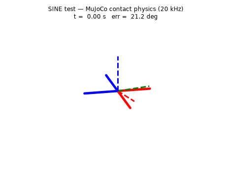
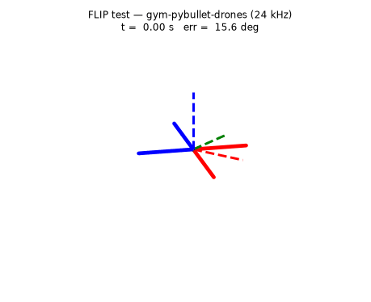
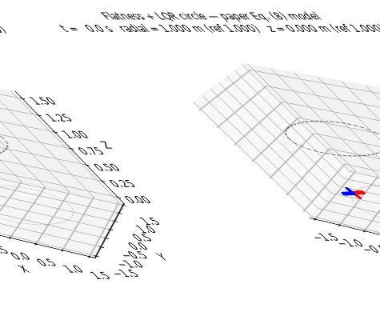
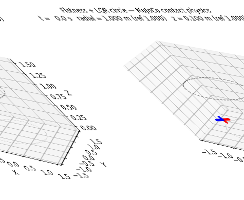

# 🎬 Simulation Recordings & Results Gallery

Animated recordings of every simulation in this repo, regenerated from the
benchmark logs by `python make_recordings.py` (outputs to `results/recordings/`).
In each attitude recording the drone is drawn exactly like the interactive
sims — **red front arms, blue rear** — against the dashed **RGB triad** of the
paper's reference attitude: perfect tracking = arms aligned with the triad.

---

## 1. The base paper's three attitude tests (Fresk & Nikolakopoulos 2013)

The frozen quaternion law (Pq=20, Pω=4, ±4 N·m) under the paper's ±0.1
sensor-noise model, on two independent physics engines. Cross-engine
agreement of the RMS tracking error: **0.03°**.

| test | gym-pybullet-drones (24 kHz) | MuJoCo contact physics (20 kHz) |
|---|---|---|
| STEP (1 rad) | RMS 17.68° · max 70.7° | RMS 17.71° · max 71.2° |
| SINE (0.5 rad) | RMS 17.52° · max 41.2° | RMS 17.61° · max 41.1° |
| FLIP (360°) | limit cycle @ 2.1 rad (finding 4) | **completes**, settles 2.88 s |

(The ~17.5° RMS floor is the paper's own sensor noise — ±0.1 on quaternion
components ≈ ±11° of measured attitude — not controller error.)

### STEP — 1 rad steps on roll/pitch/yaw

### SINE — 0.5 rad wave tracking under noise

### FLIP — 360° rotation, no gimbal lock

Static per-run figures: `results/sim_gym_pybullet/*.png`, `results/sim_mujoco/*.png`.

---

## 2. Path planning — differential flatness + quaternion LQR (Choutri & Lagha 2017)

The paper's Section V study case: circle of radius 1 m at 1 m altitude from
(−1, 0, 0), double-loop LQR at the paper's 200 Hz. **Same controller stack,
three plants:**

| plant | RMS x | RMS y | RMS z | RMS radial | peak rotor |
|---|---|---|---|---|---|
| paper Eq. (8) model | 1.5 cm | 3.6 cm | 0.6 cm | **2.7 cm** | 0.57 N |
| MuJoCo contact physics | 1.4 cm | 3.7 cm | 0.7 cm | **2.8 cm** | 1.00 N |
| MuJoCo + paper noise ±0.1 | 2.3 cm | 4.3 cm | 0.9 cm | **3.6 cm** | 1.70 N |

No rotor saturation anywhere (1.95 N limit). Radial accuracy ≈ 97%.

### Flatness circle — ideal Eq. (8) model

### Flatness circle — MuJoCo contact physics

Static figures: `results/flatness/*.png` (axis responses = paper Figs. 4–6,
3D trajectory = Fig. 7, motor signals = Fig. 8, quaternions = Fig. 9, for
both plants).

---

## 3. Interactive simulators (live, keyboard)

- `PyBullet SIM - INTERACTIVE (click me).bat` — the 3 paper tests pinned at
  one point (MuJoCo-parity attitude plant), X/Z/B keys, orbit camera, live HUD.
- `DRONE SIM - INTERACTIVE (click me).bat` — MuJoCo version with the city
  environment.

---

## Accuracy scorecard (self-assessed, /10)

| component | score | evidence | what costs the point |
|---|---|---|---|
| Fresk attitude reproduction | **9.0** | 0.03° cross-engine RMS agreement; flip completes in MuJoCo; 68-test suite | PyBullet flip limit cycle (documented engine finding, not tuned away) |
| Flatness path planning | **9.0** | 2.7–2.8 cm radial RMS on 1 m circle, identical across two plants; 3.6 cm under paper noise; no saturation | LQR weights/ESC lag are tuned assumptions (paper gives no numbers); no wind/disturbance runs yet |
| **Overall repo** | **9.0 / 10** | everything above, reproduced from CSV/npz logs by one command | path to 10: PyBullet port of the flatness stack, wind robustness, integral term on radial lag |

---

*Regenerate everything: `mmenv\python.exe -m sim.gym_pybullet.run --scenario step|sine|flip`,
`.venv310\Scripts\python.exe -m sim.mujoco.run --scenario ...`, `python -m flatness.run_paper`,
`python -m flatness.run_mujoco`, then `mmenv\python.exe make_recordings.py`.*
